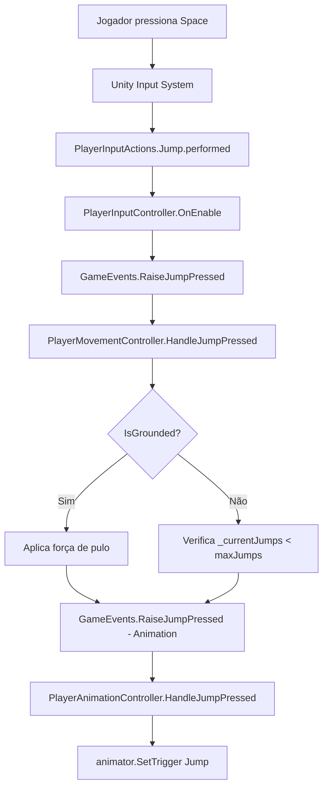

# Arquitetura Geral

[← Voltar ao Índice](../index.md)

---

## 📐 Visão Arquitetural

O projeto **MYLENA** segue uma arquitetura modular e desacoplada baseada em **Event-Driven Architecture** e **Separation of Concerns**, garantindo extensibilidade e manutenibilidade.

---

## 🎯 Princípios Fundamentais

### 1. **Separação de Responsabilidades (SRP)**
Cada classe tem uma única responsabilidade bem definida:
- `PlayerInputController` → **Apenas** lê inputs e dispara eventos
- `PlayerMovementController` → **Apenas** aplica física e movimento
- `PlayerAnimationController` → **Apenas** controla animações
- `PlayerController` → **Apenas** orquestra os sub-controllers

### 2. **Event-Driven Communication**
Componentes não se conhecem diretamente. Toda comunicação passa pelo `GameEvents`:

```csharp
// ❌ ERRADO - Acoplamento direto
playerMovement.Jump();

// ✅ CORRETO - Comunicação via eventos
GameEvents.RaiseJumpPressed();
```

### 3. **Single Source of Truth**
`GlobalVariables` (ScriptableObject) é a única fonte de configurações:

```csharp
// ❌ ERRADO - Valores hardcoded
float jumpForce = 12f;

// ✅ CORRETO - Valores centralizados
float jumpForce = GlobalVariables.Instance.jumpForce;
```

---

## 🏗️ Camadas da Arquitetura

### Layer 1: Input Layer
**Responsabilidade**: Capturar input do jogador (teclado, gamepad, mouse)

```
Unity Input System
       ↓
PlayerInputActions.cs (Auto-gerado)
       ↓
PlayerInputController.cs
```

**Características**:
- Usa Unity New Input System
- Suporte multiplataforma (Keyboard + Gamepad)
- Conversão de input bruto para eventos semânticos

---

### Layer 2: Event Layer
**Responsabilidade**: Hub central de comunicação

```
GameEvents.cs (Static Class)
    ├── OnMoveInput
    ├── OnJumpPressed
    ├── OnPlayerVelocityChanged
    └── ...
```

**Características**:
- Classe estática com delegates (eventos)
- Desacopla completamente Input → Logic → Presentation
- Fácil de debugar (ponto único de breakpoint)

---

### Layer 3: Logic Layer
**Responsabilidade**: Implementar regras de negócio e física

```
PlayerMovementController.cs
    ├── ApplyMovement()
    ├── ApplyGravity()
    ├── CheckGround()
    └── HandleJumpPressed()
```

**Características**:
- Usa Rigidbody para física
- Calcula velocidades, acelerações
- Valida estado (grounded, can jump, etc)
- Emite eventos de estado (OnPlayerGroundedChanged)

---

### Layer 4: Presentation Layer
**Responsabilidade**: Feedback visual/sonoro ao jogador

```
PlayerAnimationController.cs
    ├── HandleVelocityChanged()
    ├── HandleJumpPressed()
    └── SetAnimatorParameters()
```

**Características**:
- Escuta eventos de estado
- Atualiza Animator parameters
- Triggers de animação

---

### Layer 5: Orchestration Layer
**Responsabilidade**: Coordenar sub-sistemas e estado global

```
PlayerController.cs
    ├── _inputController
    ├── _movementController
    ├── _animationController
    └── SetCanControl(bool)
```

**Características**:
- Ponto de entrada do Player
- Liga/desliga sub-controllers
- Gerencia estado global (pausa, cutscenes)

---

## 🔄 Fluxo de Dados Completo

### Exemplo: Jogador Pressiona Space (Pulo)



**Detalhamento**:

1. **Input Capture**:
```csharp
// PlayerInputController.cs
_player.Jump.started += ctx => GameEvents.RaiseJumpPressed();
```

2. **Event Dispatch**:
```csharp
// GameEvents.cs
public static void RaiseJumpPressed() => OnJumpPressed?.Invoke();
```

3. **Logic Processing**:
```csharp
// PlayerMovementController.cs
private void HandleJumpPressed()
{
    if (_isGrounded || _currentJumps < GV.maxJumps)
    {
        var vel = _rb.linearVelocity;
        vel.y = GV.jumpForce;
        _rb.linearVelocity = vel;
        _currentJumps++;
    }
}
```

4. **Visual Feedback**:
```csharp
// PlayerAnimationController.cs
private void HandleJumpPressed()
{
    _animator.SetTrigger("Jump");
}
```

---

## 🗂️ Estrutura de Namespaces

```csharp
Mylena/
├── Mylena.Core            // Classes fundamentais (GlobalVariables, Singleton)
├── Mylena.Input           // Input System (PlayerInputActions)
├── Mylena.Player          // Controllers do Player
├── Mylena.Camera          // Sistema de câmera
├── Mylena.Events          // (Futuro) Sistema de eventos expandido
├── Mylena.UI              // (Futuro) Interface
└── Mylena.Utilities       // Helpers, Extensions
```

---

## 📦 Padrões de Design Utilizados

### 1. **Observer Pattern** (via C# Events)
Usado em `GameEvents` para comunicação desacoplada.

**Vantagens**:
- Low coupling
- Fácil adicionar novos listeners
- Testável isoladamente

**Desvantagens**:
- Performance leve overhead (negligível no contexto)
- Requer cuidado com memory leaks (unsubscribe!)

---

### 2. **Singleton Pattern**
Usado em `GlobalVariables` para configurações globais.

**Implementação**:
```csharp
public static GlobalVariables Instance { get; private set; }

private void OnEnable()
{
    Instance = this;
}
```

**Justificativa**:
- Configurações devem ser acessíveis de qualquer lugar
- ScriptableObject garante persistência no editor
- AutoLoad via `RuntimeInitializeOnLoadMethod`

---

### 3. **Component Pattern** (Unity Native)
Cada controller é um MonoBehaviour independente.

**Vantagens**:
- Fácil de adicionar/remover comportamentos
- Testável no inspector
- Modular

---

### 4. **Facade Pattern**
`PlayerController` age como fachada para sub-controllers.

**Vantagens**:
- Interface simples para sistemas externos
- Encapsula complexidade interna

---

## 🧪 Testabilidade

### Unit Tests (Futuro)
Cada controller pode ser testado isoladamente:

```csharp
[Test]
public void WhenJumpPressed_AndGrounded_ShouldApplyJumpForce()
{
    // Arrange
    var movement = CreateMovementController();
    movement._isGrounded = true;
    
    // Act
    GameEvents.RaiseJumpPressed();
    
    // Assert
    Assert.Greater(movement.GetComponent<Rigidbody>().velocity.y, 0);
}
```

### Integration Tests
Testar fluxo completo Input → Logic → Animation:

```csharp
[UnityTest]
public IEnumerator FullJumpSequence_ShouldTriggerAllSystems()
{
    // Arrange
    var player = InstantiatePlayer();
    
    // Act
    SimulateInput(InputAction.Jump);
    yield return new WaitForSeconds(0.5f);
    
    // Assert
    Assert.IsTrue(player.Animator.GetCurrentAnimatorStateInfo(0).IsName("Jump"));
}
```

---

## 🔧 Extensibilidade

### Adicionando Novas Mecânicas

**Exemplo: Implementar Dash**

1. **Adicionar eventos** em `GameEvents.cs`:
```csharp
public static event Action OnDashPressed;
public static void RaiseDashPressed() => OnDashPressed?.Invoke();
```

2. **Conectar input** em `PlayerInputController.cs`:
```csharp
_player.Dash.performed += ctx => GameEvents.RaiseDashPressed();
```

3. **Implementar lógica** em `PlayerMovementController.cs`:
```csharp
private void OnEnable()
{
    GameEvents.OnDashPressed += HandleDashPressed;
}

private void HandleDashPressed()
{
    // Lógica do dash
}
```

4. **Adicionar animação** em `PlayerAnimationController.cs`:
```csharp
private void OnEnable()
{
    GameEvents.OnDashPressed += HandleDashPressed;
}

private void HandleDashPressed()
{
    _animator.SetTrigger("Dash");
}
```

**Zero mudanças** em outras classes! ✨

---

## 📈 Escalabilidade

### Multiplayer (Futuro)
A arquitetura suporta fácil migração para multiplayer:

1. Substituir `GameEvents` (local) por `NetworkEvents` (replicado)
2. Adicionar `NetworkIdentity` ao `PlayerController`
3. Validações de input no server

### Save System (Futuro)
Dados persistentes separados da lógica:

```csharp
[Serializable]
public class PlayerSaveData
{
    public Vector3 position;
    public int currentJumps;
    // ...
}
```

---

## ⚠️ Considerações Importantes

### Performance
- Events em C# têm overhead mínimo (~1-2 ns por invoke)
- Static events não causam GC allocation
- Use `?.Invoke()` para null-safety

### Memory Leaks
**SEMPRE** desinscrever de eventos em `OnDisable`:

```csharp
private void OnDisable()
{
    GameEvents.OnJumpPressed -= HandleJumpPressed;
    // etc...
}
```

### Thread Safety
`GameEvents` é thread-safe por natureza (Unity roda em single thread).  
Se usar threads customizados no futuro, adicionar locks.

---

## 🎓 Recursos de Aprendizado

- [Unity Event System Deep Dive](https://docs.unity3d.com/Manual/EventSystem.html)
- [Clean Code in C#](https://learn.microsoft.com/en-us/dotnet/csharp/)
- [SOLID Principles](https://en.wikipedia.org/wiki/SOLID)

---

[← Voltar ao Índice](../index.md) | [Próximo: Sistema de Eventos →](event-system.md)
